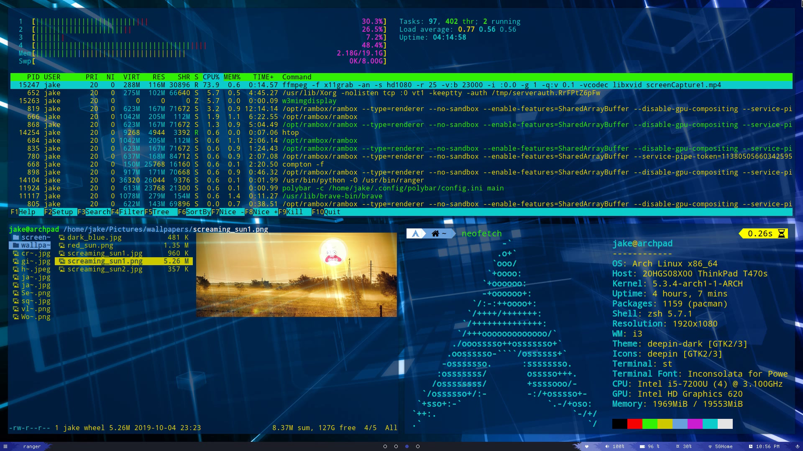

# Dotfiles

This repo contains most of my configuration files for my Arch Linux + i3Gaps ThinkPad T470s laptop.  Currently, my configuration for the following software is in the repo:

* window managers
  * i3-gaps
  * qtile
* status bars
  * polybar
  * bumblebee
* file explorers
  * nnn
  * ranger
* shells
  * zsh
  * zinit (manager)
  * starship (prompt)
* terminal emulators
  * kitty
  * alacritty
  * st
* text editors
  * neovim v0.7: `docker pull ghcr.io/jrodal98/nvim:latest` for a docker image compatible with amd64 and arm64 architectures
* misc
  * dunst

and probably other things.

- A list of all of my pacman packages is in [packages.txt](packages.txt)

## dotfile management

* I'm using [dotbare](https://github.com/kazhala/dotbare), whose configuration lives inside my .zshrc
* I use githooks, which are listed in .githooks. Run `dotbare config core.hooksPath ~/.githooks` upon cloning the repository.
