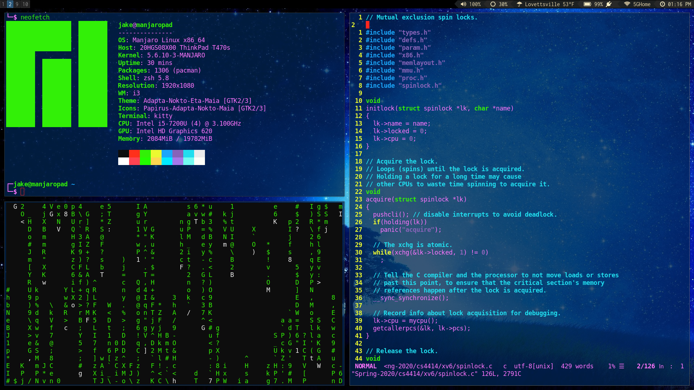

# Jake's Dotfiles



This repo contains most of my configuration files for my Arch Linux + i3Gaps ThinkPad T470s laptop.  Currently, my configuration for the following software is in the repo:

1) i3-gaps
2) polybar
3) ranger
4) zsh
5) suckless terminal (fork of simple terminal)

A general .Xresources is provided as well (it's currently only used on my terminal).

A (probably) complete list of my fonts is provided in a text file as well.  I have 2.5 G worth of fonts, so I deemed pushing them to the repo as unsavory.

I generated the list with the following sequence of commands:

```bash
pacman -Q | rg font > my_fonts.txt
pacman -Q | rg ttf >> my_fonts.txt
```

It's possible (and probably likely) that this is an incomplete list of fonts, as I may have manually installed a few and some might not have "font" or "ttf" in their name.

